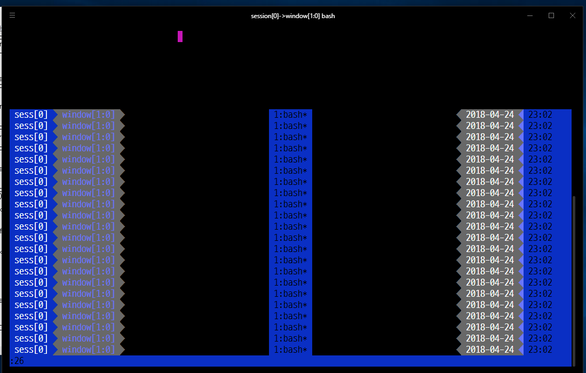

# Hyper

* 테스트 일자: `2018-04-24`
* 버전: `2.0.0`

# 기본

## 설치의 용이

**설치 과정**

1. [홈페이지](https://hyper.is/) 접속
2. `Download Hyper for Windows` 클릭
3. 다운로드, 실행
4. 설치 완료

**평가**

설치 마법사도 없이 순식간에 설치가 된다는 점은 마음에 들었다

## 사용자화

`Ctrl + ,` 혹은 윈도우 사용자 디렉토리의 `.hyper.js`를 열어 기본적인 사용자화 설정이 가능하다

*작성 시점에서 Hyper의 Plugins, Themes 스토어가 죽어서 테스트를 해볼 수 없었음*

## 탭 기능

* 일반적으로 `Ctrl + T` 로 탭을 만들고 `Ctrl + W` 으로 닫는 것을 기대하지만 `Shift` 까지 단축키로 눌러야하는 점은 조금 귀찮다
* `Ctrl + Alt + ←/→`이나 `Ctrl + Shift + ←/→`로 좌우 탭 전환이 가능하다

## 256 색상

* https://gist.github.com/HaleTom/89ffe32783f89f403bba96bd7bcd1263

개발자들에 따르면 윈도우의 문제로 256색 지원이 현재는 불가능하다고 한다

## Ctrl, Alt, Shift 등의 단축키

## 성능

* 시작 속도는 그다지 빠르지 않다

## 복사, 붙여넣기

* `Ctrl + C` 와 `Ctrl + V` 로 복사 & 붙여넣기가 되지 않는 다는 점은 아쉽다
  * 대신 `Shift` 까지 포함된 단축키는 사용 가능

# 유니코드

## 입력, 출력, 정규화

* 유니코드 입력, 출력에 큰 문제가 보이진 않음
  * 이모지 출력도 문제가 없음
  * Google 일본어 IME를 설치 후 일본어를 입력할 때에도 문제가 없음
* 정규화의 경우 자체적으로 NFC로 정규화하여 출력하는 방식이 아니고 NFD 형태 그대로 출력에 문제가 없음

# WSL

## 기본 지원

* 설정 파일 한줄 수정으로 바로 WSL에 연동이 가능하다
  * 참고 : https://github.com/zeit/hyper/issues/1596

## 윈도우 연동

* 윈도우의 파일이나 디렉토리를 터미널에 드래그 & 드롭 했을 때 자동으로 `/mnt/c/~~~` 형태로 변경되지 않음

# 기타

## 마우스 지원

## 폰트 렌더링

폰트를 D2Coding로 설정했을 경우 봐줄만한 결과가 나옴

## Powerline 문자

* Powerline 문자를 이용하는 [tmux 설정파일](https://github.com/Snack-X/setting/blob/master/tmux/.tmux.conf)을 이용해 테스트

글자 너비를 제대로 인식 못하는지 제대로 출력되지 않음

## 미니멀 & 포터블
